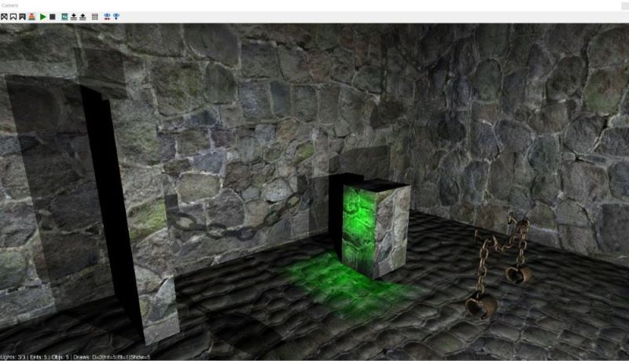
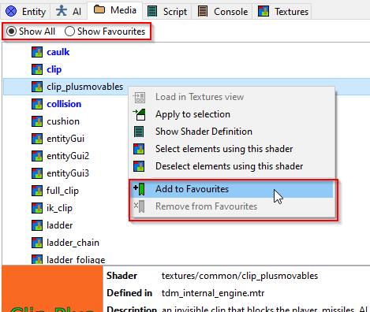
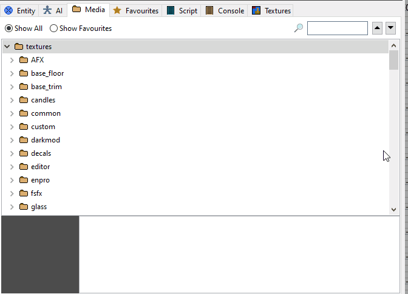

  <h2>
    2023-02-03
    DarkRadiant 3.8.0 released  
  </h2>
  
What's new:

  <ul>
    <li>Feature: Support new frob-related material keywords</li>
    <li>Improvement: Mission selection list in Game setup is not alphabetically sorted</li>
    <li>Improvement: Better distinction between inherited and regular spawnargs</li>
    <li>Improvement: Silence sound shader button</li>
    <li>Improvement: Add Reload Definitions button to Model Chooser</li>
    <li>Fixed: Model Selector widgets are cut off and flicker constantly on Linux</li>
    <li>Fixed: DarkRadiant will not start without Dark Mod plugins</li>
    <li>Fixed: GenericEntityNode not calculating the direction correctly with "editor_rotatable"</li>
    <li>Fixed: RenderableArrow not drawing the tip correctly for arbitrary rotations</li>
    <li>Fixed: Light Inspector crashes on Linux</li>
    <li>Fixed: Models glitch out when filtering then showing them</li>
    <li>Fixed: Skin Editor: models not centered well in preview</li>
    <li>Fixed: "Copy Resource Path" includes top level folders</li>
    <li>Fixed: Skin Editor: internal test skins are shown if Material Editor was open previously</li>
    <li>Fixed: Changing Game/Project doesn't update loaded assets correctly</li>
    <li>Fixed: Model Chooser: initially hidden materials aren't revealed when enabling them</li>
    <li>Fixed: Choosing AI entity class 'atdm:townsfolk_commoner_update' causes crash</li>
    <li>Fixed: Sporadic assertion failure on shutdown due to LocalBitmapArtProvider destruction</li>
    <li>Fixed: Prefab Selector spams infinite error dialogs on Linux</li>
  </ul>
  
It's recommended to prefer this version over any previous release. View the full list of changes on our .

  
Get DarkRadiant by using the shortcuts on this page or the ones in the <a href="download.html">Download</a> section.

  <h2>
    2022-11-22
    DarkRadiant 3.7.0 released  
  </h2>
  
What's new:

  <ul>
    <li>Feature: Skin Editor</li>
    <li>Improvement: Script Window usability improvements</li>
    <li>Fixed: Hitting escape while autosaving crashes to desktop</li>
    <li>Fixed: Def parsing problem in tdm_playertools_lockpicks.def</li>
    <li>Fixed: DR hangs if selecting a lot of entities with entity list open</li>
    <li>Fixed: Float Property Editor's entry box is sticking around after selecting a float key</li>
    <li>Fixed: Spline entities without model spawnarg are unselectable</li>
    <li>Fixed: Entity window resets interior sizing forcing resize each time it is opened</li>
    <li>Fixed: Spline curves should not be created with a model spawnarg</li>
    <li>Fixed: Newly appended curve control vertices aren't shown at first</li>
    <li>Fixed: Light entities are zoomed out in preview window</li>
    <li>Fixed: Entity inspector spawnarg fields not always updated by UI windows such as Model Chooser</li>
  </ul>
  
It's recommended to prefer this version over any previous release. View the full list of changes on our .

  
Get DarkRadiant by using the shortcuts on this page or the ones in the <a href="download.html">Download</a> section.

  <h2>
    2022-11-12
    DarkRadiant 3.6.0 released  
  </h2>
  
What's new:

  <ul>
    <li>Feature: Selection Focus</li>
    <li>Feature: Add Radiant.findEntityByName script method</li>
    <li>Feature: Media Browser shows a thumbnail preview when selecting folders</li>
    <li>Feature: Map is remembering layer visibilities between loads</li>
    <li>Fixed: ModelDefs are shown in T-pose</li>
    <li>Fixed: Patch vertices are the wrong colour</li>
    <li>Fixed: Shader Clipboard source gets cleared on 'copy shader' operation</li>
    <li>Fixed: Nodes of hidden layers are still visible after loading the map</li>
    <li>Fixed: Can't close properties window</li>
    <li>Fixed: Merge Action rendering is broken</li>
    <li>Fixed: After using ToggleMainControl_Camera, the center panel is grey after restart</li>
    <li>Fixed: When using ToggleMainControl_Camera, arrow keys cannot be used to move the viewer</li>
    <li>Fixed: Property Panel not remembering undocked/closed tabs</li>
    <li>Fixed: Texture Tool not updating during manipulation</li>
    <li>Fixed: Orthoview ignores filters for surfaces in models</li>
    <li>Fixed: Blue dot when selecting one face removed</li>
    <li>Tweak: Conversation Editor: double-click opens selected conversation</li>
    <li>Tweak: Preference option to disable drag select in camera view</li>
    <li>Tweak: ESC key should clear the resource tree view filter text</li>
    <li>Tweak: New layers function: tooltip popup getting in the way</li>
  </ul>
  
It's recommended to prefer this version over any previous release. View the full list of changes on our .

  
Get DarkRadiant by using the shortcuts on this page or the ones in the <a href="download.html">Download</a> section.

  <h2>
    2022-10-28
    DarkRadiant 3.5.0 released  
  </h2>
  
What's new:

  <ul>
    <li>Feature: More customisable layout, all windows and panes can be dragged and arranged</li>
    <li>Layouts like Embedded, Regular and Splitpane are superseded and have been removed</li>
    <li>Tweak: The LayerControlPanel's tooltip popup is now less annoying</li>
    <li>Tweak: Clarify distinction between Shadow render mode and other render modes</li>
    <li>Fixed: Show/hide Light Volumes for combined entities inconsistent</li>
    <li>Fixed: Currently applied particleDef not selected in Particle Selector</li>
    <li>Fixed: Layer visibility checkbox not reacting to double-clicks</li>
    <li>Fixed: Cannot toggle visibility of layers in Linux</li>
    <li>Fixed: Drag-and-dropping layers is not working in Linux</li>
  </ul>
  
It's recommended to prefer this version over any previous release. View the full list of changes on our .

  
Get DarkRadiant by using the shortcuts on this page or the ones in the <a href="download.html">Download</a> section.

  <h2>
    2022-10-09
    DarkRadiant 3.4.0 released  
  </h2>
  
What's new:

  <ul>
    <li>Feature: Allow Layers to be arranged into a Tree</li>
    <li>Fixed: Readable Editor displays "shader not found" in view</li>
    <li>Fixed: Undoing snap to grid with prefabs causes crash</li>
    <li>Fixed: Include doc in building instructions</li>
    <li>Fixed: Decal textures causes DR to crash</li>
    <li>Fixed: Skin chooser: double click on materials list closes window</li>
    <li>Fixed: Selecting and deselecting a filtered child brush through layers leaves the brush selected</li>
    <li>Fixed: Material editor re-sorts stages on pasting image map resulting in wrong material stages list and wrong selected stage</li>
    <li>Fixed: Crash on start if engine path is choosen (Doom 3)</li>
  </ul>
  
It's recommended to prefer this version over any previous release. View the full list of changes on our .

  
Get DarkRadiant by using the shortcuts on this page or the ones in the <a href="download.html">Download</a> section.

  <h2>
    2022-09-23
    DarkRadiant 3.3.0 released  
  </h2>
  
What's new:

  <ul>
    <li>Feature: Remove menu options which are not applicable to current game</li>
    <li>Feature: Grey-out menu entries that are not applicable</li>
    <li>Feature: FX Declaration Parsing Support</li>
    <li>Feature: FX Chooser</li>
    <li>Feature: Renderer now takes "translucent" keyword into account</li>
    <li>Fixed: Lighting Mode Renderer draws hidden lights</li>
    <li>Fixed: Loading map results in &quot;Real Hard DarkRadiant Failure&quot; exception</li>
    <li>Fixed: Crash when trying to set default mouse or keyboard bindings</li>
    <li>Fixed: Unit Tests intermittently get stuck on Github runner</li>
    <li>Fixed: xmlutil thread safety problems</li>
    <li>Fixed: Some materials aren't displayed correctly</li>
  </ul>
  
It's recommended to prefer this version over any previous release. View the full list of changes on our .

  
Get DarkRadiant by using the shortcuts on this page or the ones in the <a href="download.html">Download</a> section.

  <h2>
    2022-09-03
    DarkRadiant 3.2.0 released  
  </h2>
  
What's new:

  <ul>
    <li>Feature: Show entityDefs related to selected models in Model Chooser</li>
    <li>Feature: Support for rendering blend lights</li>
    <li>Feature: Implement sorting of Interaction Stages</li>
    <li>Feature: Recognise type of "set x on y" spawnargs</li>
    <li>Feature: OBJ files: loader supports usemtl keywords directly referencing material names (without .mtl file)</li>
    <li>Fixed: Material editor: additional preview object in textures/glass/ materials</li>
    <li>Fixed: Every attempt to load a texture will trigger a SIGSEGV signal caught: 11</li>
    <li>Improvement: Update to wxWidgets 3.2.0</li>
  </ul>
  
It's recommended to prefer this version over any previous release. View the full list of changes on our .

  
Get DarkRadiant by using the shortcuts on this page or the ones in the <a href="download.html">Download</a> section.

  <h2>
    2022-08-21
    DarkRadiant 3.1.0 released  
  </h2>
  
What's new:

  <ul>
    <li>The Texture Tool got its Free Scale operator now, allowing you to fit the texture with the mouse instead of having to type in the percentages.</li>
    <li>A lot of work went into the Declaration handling (EntityDef, Skins, Materials, Particles, etc.), which is now much more robust and more conformant to how the game is doing things (at least until TDM 2.10).</li>
    <li>The Material Editor got a plethora of issues resolved</li>
    <li>Improved the Model Export dialog and options</li>
  </ul>
  
It's recommended to prefer this version over any previous release. View the full list of changes on our .

  
Get DarkRadiant by using the shortcuts on this page or the ones in the <a href="download.html">Download</a> section.

  <h2>
    2022-06-15
    DarkRadiant 3.0.0 released  
  </h2>
  
It took a while, but DarkRadiant 3.0.0 is finally available. Most of the time has been spent on improving DarkRadiant's renderer, which now features shadow mapping support of up to 6 lights. It's still not matching the engine's output (especially in terms of performance), but it should be faster and much more helpful than it was before.

  

  
The effort that has been put into the renderer rewrite plus the bigger changes in the previous few releases make the jump to the next major version feel more than justified. Besides of that, a lot of non-renderer issues have been resolved in this release too, next to some fine usability improvements.
 
  
It's recommended to prefer this version over any previous release. View the full list of changes on our .

  
Get DarkRadiant by using the shortcuts on this page or the ones in the <a href="download.html">Download</a> section.

  <h2>
    2021-11-27
    DarkRadiant 2.14.0 released  
  </h2>
  
DarkRadiant 2.14.0 is available. This release focused on DarkRadiant's texturing abilities, the Texture Tool and some of the Surface Inspector algorithms have been completely rewritten. A new model importer UI has been added with the ability to convert FBX models into a format compatible to the game (it can also convert LWO, ASE and OBJ models). The EntityInspector can now deal with more than one selected entities, showing the shared key values in the list.
 
  
It's recommended to prefer this version over any previous release. View the full list of fixes on our . 

  
Get DarkRadiant by using the shortcuts on this page or the ones in the <a href="download.html">Download</a> section.

  <h2>
    2021-08-09
    DarkRadiant 2.13.0 released  
  </h2>
  
DarkRadiant 2.13.0 is ready for download. A lot of fixes and improvements made it into this release. Support for multiple .lin point files has been added, to better support the visualisation of &quot;internal&quot; visportal leaks. DarkRadiant is now capable of comparing maps, both in differential A vs. B comparisons as well as three-way merge scenarios (when both maps share the same ancestor).
 
  
It's recommended to prefer this version over any previous release. View the full list of fixes on our . 

  
Get DarkRadiant by using the shortcuts on this page or the ones in the <a href="download.html">Download</a> section.

  <h2>
    2021-05-01
    DarkRadiant 2.12.0 available  
  </h2>
  
DarkRadiant 2.12.0 is ready for download. Feature highlights include a new customisable GUI and the first iteration of the Material Editor GUI, next to a number of bug fixes and improvements.
 
  
It's recommended to prefer this version over any previous release. View the full list of fixes on our . 

  
Get DarkRadiant by using the shortcuts on this page or the ones in the <a href="download.html">Download</a> section.

  <h2>
    2021-01-29
    DarkRadiant 2.11.0 available  
  </h2>
  
DarkRadiant 2.11.0 is ready for release. Next to bug fixes and GUI improvements (also to the recently added TDM Game Connection plugin) this build enables users to manage their favourite resources like materials, entities, sound shaders. The search function of resource trees has been improved too.
 
  
&nbsp;

  
It's recommended to prefer this version over any previous release. View the full list of fixes on our . 

  
Get DarkRadiant by using the shortcuts on this page or the ones in the <a href="download.html">Download</a> section.

  <h2>
    2020-12-26
    DarkRadiant 2.10.0 released  
  </h2>
  
DarkRadiant 2.10.0 is ready for download. It adds a couple of interesting features for mappers, like welding/merging patches, opening maps from PK4 files and adjustable light colours and orthoview font sizes. It's recommended to prefer this version over any previous release. View the full list of fixes on our . 

  
Get DarkRadiant by using the shortcuts on this page or the ones in the <a href="download.html">Download</a> section.

  <h2>
    2020-11-19
    DarkRadiant 2.9.1 released  
  </h2>
  
DarkRadiant 2.9.1 fixes a freeze issue that has slipped into the recent 2.9.0 release (refer to the changelog of 2.9.0 below to see what has changed there).
  It's recommended to prefer this version over any previous release. View the full list of fixes on our . 

  
Get DarkRadiant by using the shortcuts on this page or the ones in the <a href="download.html">Download</a> section.

  <h2>
    2020-11-18
    DarkRadiant 2.9.0 released  
  </h2>
  
DarkRadiant 2.9.0 is ready for its public release. This version includes a large change to DarkRadiant's module architecture, separating UI code from the actual algorithms almost everywhere. Aside from that, most efforts went into bug fixing and stabilisation - with the occasional convenience feature here and there. TDM mappers will like the first incarnation of the TDM Game Connection plugin (usable in TDM 2.09+) 
  <iframe width="560" height="315" src="https://www.youtube.com/embed/abk-81BuS1Q" frameborder="0" allow="accelerometer; autoplay; clipboard-write; encrypted-media; gyroscope; picture-in-picture" allowfullscreen></iframe>  
  It's recommended to prefer this version over any previous release. View the full list of fixes on our . 

  
Get DarkRadiant by using the shortcuts on this page or the ones in the <a href="download.html">Download</a> section.

  <h2>
    2020-05-02
    DarkRadiant 2.8.0 is ready for download  
  </h2>
  
DarkRadiant 2.8.0 is available. Next to a considerable number of bugfixes and improvements, a nice amount of new editing features made it into this build. There's a new way to select items by filter, it's possible to retain grouping information when copy-pasting between DarkRadiant sessions, a new "Select Parent Entities" command has been added, and more. 
  It's recommended to prefer this version over any previous release. View the full list of fixes on our . 

  
Get DarkRadiant by using the shortcuts on this page or the ones in the <a href="download.html">Download</a> section.

  <h2>
    2020-01-14
    DarkRadiant 2.7.0 is available  
  </h2>
  
DarkRadiant 2.7.0 is ready for download. This release is 90% about fixed bugs and usability issues. Nonetheless, the type-to-search functionality in lists and tree views has been improved, and the Game/Project Setup now shows recently used custom paths in the mission drop down list. OrbWeaver has been working on a DarkRadiant user guide which is continuously expanded and available on the website <a href="/userguide">https://www.darkradiant.net/userguide</a> (also accessible through the About > User Guide menu option).
  It's recommended to prefer this version over any previous release. View the full list of fixes on our . 

  
Get DarkRadiant by using the shortcuts on this page or the ones in the <a href="download.html">Download</a> section.

  <h2>
    2018-05-10
    DarkRadiant 2.6.0 released  
  </h2>
  
DarkRadiant 2.6.0 is ready for use. This feature release is further improving on the Model Exporting capabilities and introduces smaller features like a mapping time stopwatch and the ability to define favourites in the Media Browser, making it more convenient to work with a large number of materials. On top of that, this build offers a number of fixes and improvement for various parts of the editor. It's recommended to prefer this version over any previous release. View the full list of fixes on our . 

  
Get DarkRadiant by using the shortcuts on this page or the ones in the <a href="download.html">Download</a> section.

  <h2>
    2017-12-24
    DarkRadiant 2.5.0 is ready for download  
  </h2>
  
DarkRadiant 2.5.0 is ready for use. This is a feature release introducing a new Game Setup dialog, which can adapt itself to the selected game type. More specifically, The Dark Mod mappers are now supported by a custom setup dialog with options to create their mission folder setup right from within DarkRadiant, plus a few safety checks to notify them about a possibly wrong folder configuration. Moreover, new dialogs for editing the TDM mission description files (readme.txt and darkmod.txt) have been added featuring a live preview of the edited texts. It's recommended to prefer this version over any previous release. View the full list of fixes on our . 

  
Get DarkRadiant by using the shortcuts on this page or the ones in the <a href="download.html">Download</a> section.

  <h2>
    2017-09-26
    DarkRadiant 2.4.0 available  
  </h2>
  
DarkRadiant 2.4.0 is ready for use. This release fixes a few annoying bugs and introduces a new Model Export feature, allowing editors to export the current selection to ASE, LWO or OBJ (including brushes, patches and models). It's recommended to prefer this version over any previous release. View the full list of fixes on our . 

  
Get DarkRadiant by using the shortcuts on this page or the ones in the <a href="download.html">Download</a> section.

  <h2>
    2017-07-23
    DarkRadiant 2.3.0 released  
  </h2>
  
DarkRadiant 2.3.0 is ready for use. This is a feature release containing a few bugfixes and stabilisations. It's recommended to prefer this version over any previous release. View the full list of fixes on our . 

  
Get DarkRadiant by using the shortcuts on this page or the ones in the <a href="download.html">Download</a> section.

  <h2>
    2017-06-25
    Website moved to www.darkradiant.net  
  </h2>
  
The DarkRadiant website has been moved to <a href="http://www.darkradiant.net">www.darkradiant.net</a>, hosted through GitHub Pages. The old site on darkradiant.sourceforge.net will be decommissioned soon and replaced with some redirects.

  <h2>
    2017-02-07
    DarkRadiant 2.2.1 released  
  </h2>
  
DarkRadiant 2.2.1 is ready for use. This is a feature release containing a few bugfixes and stabilisations. It's recommended to prefer this version over any previous releases. View the full list of fixes on our . It should be preferred over the previously 2.2.0 which shipped with a menu bug.

  
  

  <h2>
    2016-11-18
    DarkRadiant 2.1.0 is out
  </h2>
  
DarkRadiant 2.1.0 is ready for use. This is a feature release containing a few bugfixes and stabilisations. It's recommended to prefer this version over any previous releases. View the full list of fixes on our .

  
  

  <h2>
    2016-06-04
    DarkRadiant 2.0.4 released
  </h2>
  
DarkRadiant 2.0.4 is ready for use. This is a bugifx/stabilisation release containing a few nice additions for mappers.. It's recommended to prefer this release over any previous releaes. View the full list of fixes on our .

  
If you haven't installed it already please update the VC++ 2013 support files, get them here: <a href="http://www.microsoft.com/en-us/download/details.aspx?id=40784">VC++ 2013 Redistributable Package (all platforms)</a>

  
  

  <h2>
    2015-12-30
    DarkRadiant 2.0.3 released
  </h2>
  
DarkRadiant 2.0.3 is ready for use. This is a bugifx/stabilisation release. It's recommended to prefer this release over the older 2.0.2. View the full list of fixes on our .

  
If you haven't installed it already please update the VC++ 2013 support files, get them here: <a href="http://www.microsoft.com/en-us/download/details.aspx?id=40784">VC++ 2013 Redistributable Package (all platforms)</a>

  
  

  <h2>
    2015-01-10
    DarkRadiant 2.0.2 available
  </h2>
  
DarkRadiant 2.0.2 is ready for use. This is a bugifx/stabilisation release. It's recommended to prefer this release over the recent 2.0.1. View the full list of fixes on our .

  
If you haven't installed it already please update the VC++ 2013 support files, get them here: <a href="http://www.microsoft.com/en-us/download/details.aspx?id=40784">VC++ 2013 Redistributable Package (all platforms)</a>

  
  

  <h2>
    2014-11-15
    DarkRadiant 2.0.1 released
  </h2>
  
DarkRadiant 2.0.1 is ready for use. This is a bugifx/stabilisation release. It's recommended to prefer this release over the recent 2.0.0. View the full list of fixes on our .

  
If you haven't installed it already please update the VC++ 2013 support files, get them here: <a href="http://www.microsoft.com/en-us/download/details.aspx?id=40784">VC++ 2013 Redistributable Package (all platforms)</a>

  
  

  <h2>
    2014-10-10
    DarkRadiant 2.0.0 released
  </h2>
  
DarkRadiant 2.0.0 is finally ready for download. This is a major release, the entire UI code has been migrated from GTK+2 to wxWidgets 3.0. Most of the work went into the migration, but a few features and stability fixes made it into this release nonetheless, for example fixed rendering of projected lights and some usability improvements.. View the full list of fixes on our .

  
If you haven't installed it already please update the VC++ 2013 support files, get them here: <a href="http://www.microsoft.com/en-us/download/details.aspx?id=40784">VC++ 2013 Redistributable Package (all platforms)</a>

  
  

  <h2>&gt;&gt; <a href="news_archive.html">News Archive</a></h2>

