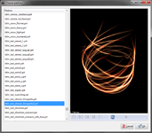
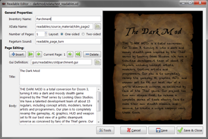
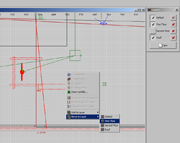

<table cellspacing="0" cellpadding="0" class="header">
    <tr>
      <th width="90">2011-04-23</th>
      <th>DarkRadiant 1.6.1 available</th>
    </tr>
  </table>
  <table cellspacing="0" cellpadding="0" class="content">
    <tr>
      <td>
DarkRadiant 1.6.1 is a maintenance or bugfix release which resolves a few issues that came up since 1.6.0.

          
Important

          
Starting with this release the Windows build is compiled using VC++ 2010, so be sure to install the <strong>VC++ 2010</strong> redistributable package in order to run this release:
			<ul>
				<li><a href="http://www.microsoft.com/downloads/en/details.aspx?familyid=A7B7A05E-6DE6-4D3A-A423-37BF0912DB84&displaylang=en">VC++ 2010 Redistributable Package 32 Bit</a></li>
				<li><a href="http://www.microsoft.com/downloads/en/details.aspx?displaylang=en&FamilyID=bd512d9e-43c8-4655-81bf-9350143d5867">VC++ 2010 Redistributable Package 64 Bit</a></li>
			</ul>
		  

          
As usual, you can also take a look at the <a href="http://darkradiant.svn.sourceforge.net/viewvc/darkradiant/trunk/darkradiant/ChangeLog?view=markup" target="_blank">developer changelog</a>, if you're interested in a detailed list of changes.

          
Windows 32-bit

          <ul>
            <li><a href="https://sourceforge.net/projects/darkradiant/files/darkradiant/1.6.1/darkradiant-1.6.1.exe/download" target="_blank"><strong>Download</strong></a> (Installer, Windows 32-bit)</li>
            <li><a href="https://sourceforge.net/projects/darkradiant/files/darkradiant/1.6.1/darkradiant-1.6.1.zip/download" target="_blank"><strong>Download</strong></a> (ZIP, Windows 32-bit) </li>
          </ul>
          
Windows 64-bit

          <ul>
            <li><a href="https://sourceforge.net/projects/darkradiant/files/darkradiant/1.6.1/darkradiant-1.6.1.x64.exe/download" target="_blank"><strong>Download</strong></a> (Installer, Windows x64)</li>
            <li><a href="https://sourceforge.net/projects/darkradiant/files/darkradiant/1.6.1/darkradiant-1.6.1.x64.zip/download" target="_blank"><strong>Download</strong></a> (ZIP, Windows x64) </li>
          </ul>
          
Ubuntu / Kubuntu Linux

          <ul>
            <li>Please follow the instructions on our <a href="https://launchpad.net/~orbweaver/+archive/darkradiant">Launchpad page</a> to download a DarkRadiant package for Ubuntu.</li>
          </ul></td>
    </tr>
  </table>
  <table cellspacing="0" cellpadding="0" class="header">
    <tr>
      <th width="90">2011-04-08</th>
      <th>DarkRadiant 1.6.0 available</th>
    </tr>
  </table>
  <table cellspacing="0" cellpadding="0" class="content">
    <tr>
      <td>
DarkRadiant 1.6.0 introduces native support for the Quake 4 Map Format as well as a rudimentary quake4.game definition (to be tested, feedback is welcome). The 3D renderer went through some profiling and
			is operating considerably faster now. A few bugs and crashes have been fixed as well.

          
Important

          
Starting with this release the Windows build is compiled using VC++ 2010, so be sure to install the <strong>VC++ 2010</strong> redistributable package in order to run this release:
			<ul>
				<li><a href="http://www.microsoft.com/downloads/en/details.aspx?familyid=A7B7A05E-6DE6-4D3A-A423-37BF0912DB84&displaylang=en">VC++ 2010 Redistributable Package 32 Bit</a></li>
				<li><a href="http://www.microsoft.com/downloads/en/details.aspx?displaylang=en&FamilyID=bd512d9e-43c8-4655-81bf-9350143d5867">VC++ 2010 Redistributable Package 64 Bit</a></li>
			</ul>
		  

          
As usual, you can also take a look at the <a href="http://darkradiant.svn.sourceforge.net/viewvc/darkradiant/trunk/darkradiant/ChangeLog?view=markup" target="_blank">developer changelog</a>, if you're interested in a detailed list of changes.

          
Windows 32-bit

          <ul>
            <li><a href="https://sourceforge.net/projects/darkradiant/files/darkradiant/1.6.0/darkradiant-1.6.0.exe/download" target="_blank"><strong>Download</strong></a> (Installer, Windows 32-bit)</li>
            <li><a href="https://sourceforge.net/projects/darkradiant/files/darkradiant/1.6.0/darkradiant-1.6.0.zip/download" target="_blank"><strong>Download</strong></a> (ZIP, Windows 32-bit) </li>
          </ul>
          
Windows 64-bit

          <ul>
            <li><a href="https://sourceforge.net/projects/darkradiant/files/darkradiant/1.6.0/darkradiant-1.6.0.x64.exe/download" target="_blank"><strong>Download</strong></a> (Installer, Windows x64)</li>
            <li><a href="https://sourceforge.net/projects/darkradiant/files/darkradiant/1.6.0/darkradiant-1.6.0.x64.zip/download" target="_blank"><strong>Download</strong></a> (ZIP, Windows x64) </li>
          </ul>
          
Ubuntu / Kubuntu Linux

          <ul>
            <li>Please follow the instructions on our <a href="https://launchpad.net/~orbweaver/+archive/darkradiant">Launchpad page</a> to download a DarkRadiant package for Ubuntu.</li>
          </ul></td>
    </tr>
  </table>
  <table cellspacing="0" cellpadding="0" class="header">
    <tr>
      <th width="90">2011-01-21</th>
      <th>DarkRadiant 1.5.0 released</th>
    </tr>
  </table>
  <table cellspacing="0" cellpadding="0" class="content">
    <tr>
      <td>
As most prominent feature DarkRadiant 1.5.0 provides a newly written Particle Previewer, including real-time particle rendering. Besides a few bugfixes and usability improvements, the major changes happened behind the scenes (all the UI code has been refactored to use GTK's C++ interface gtkmm).

	  

          
Important

          
Starting with this release the Windows build is compiled using VC++ 2010, so be sure to install the <strong>VC++ 2010</strong> redistributable package in order to run this release:
			<ul>
				<li><a href="http://www.microsoft.com/downloads/en/details.aspx?familyid=A7B7A05E-6DE6-4D3A-A423-37BF0912DB84&displaylang=en">VC++ 2010 Redistributable Package 32 Bit</a></li>
				<li><a href="http://www.microsoft.com/downloads/en/details.aspx?displaylang=en&FamilyID=bd512d9e-43c8-4655-81bf-9350143d5867">VC++ 2010 Redistributable Package 64 Bit</a></li>
			</ul>
		  

          
As usual, you can also take a look at the <a href="http://darkradiant.svn.sourceforge.net/viewvc/darkradiant/trunk/darkradiant/ChangeLog?view=markup" target="_blank">developer changelog</a>, if you're interested in a detailed list of changes.

          
Windows 32-bit

          <ul>
            <li><a href="https://sourceforge.net/projects/darkradiant/files/darkradiant/1.5.0/darkradiant-1.5.0.exe/download" target="_blank"><strong>Download</strong></a> (Installer, Windows 32-bit)</li>
            <li><a href="https://sourceforge.net/projects/darkradiant/files/darkradiant/1.5.0/darkradiant-1.5.0.zip/download" target="_blank"><strong>Download</strong></a> (ZIP, Windows 32-bit) </li>
          </ul>
          
Windows 64-bit

          <ul>
            <li><a href="https://sourceforge.net/projects/darkradiant/files/darkradiant/1.5.0/darkradiant-1.5.0.x64.exe/download" target="_blank"><strong>Download</strong></a> (Installer, Windows x64)</li>
            <li><a href="https://sourceforge.net/projects/darkradiant/files/darkradiant/1.5.0/darkradiant-1.5.0.x64.zip/download" target="_blank"><strong>Download</strong></a> (ZIP, Windows x64) </li>
          </ul>
          
Ubuntu / Kubuntu Linux

          <ul>
            <li>Please follow the instructions on our <a href="https://launchpad.net/~orbweaver/+archive/darkradiant">Launchpad page</a> to download a DarkRadiant package for Ubuntu.</li>
          </ul></td>
    </tr>
  </table>
  <table cellspacing="0" cellpadding="0" class="header">
    <tr>
      <th width="90">2010-07-21</th>
      <th>DarkRadiant 1.4.0 released</th>
    </tr>
  </table>
  <table cellspacing="0" cellpadding="0" class="content">
    <tr>
      <td colspan="2">
The 1.4.0  release introduces a small set of new features, including Selection Sets, a new Group Part selection mode, Vocal Set  Chooser (for TDM 1.03+) and a couple of bugfixes.

          
Important

          
Be sure to install  the <strong><a href="http://www.microsoft.com/downloads/details.aspx?FamilyID=9B2DA534-3E03-4391-8A4D-074B9F2BC1BF&amp;displaylang=en" target="_blank">VC++ 2008</a></strong><a href="http://www.microsoft.com/downloads/details.aspx?FamilyID=9B2DA534-3E03-4391-8A4D-074B9F2BC1BF&amp;displaylang=en"> redistributable package</a> in order to run this release. 

          
As usual, you can also take a look at the <a href="http://darkradiant.svn.sourceforge.net/viewvc/darkradiant/trunk/darkradiant/ChangeLog?view=markup" target="_blank">developer changelog</a>, if you're interested in a detailed list of changes.

          
Windows 32-bit

          <ul>
            <li><a href="https://sourceforge.net/projects/darkradiant/files/darkradiant/1.4.0/darkradiant-1.4.0.exe/download" target="_blank"><strong>Download</strong></a> (Installer, Windows 32-bit)</li>
            <li><a href="https://sourceforge.net/projects/darkradiant/files/darkradiant/1.4.0/darkradiant-1.4.0.zip/download" target="_blank"><strong>Download</strong></a> (ZIP, Windows 32-bit) </li>
          </ul>
          
Windows 64-bit

          <ul>
            <li><a href="https://sourceforge.net/projects/darkradiant/files/darkradiant/1.4.0/darkradiant-1.4.0.x64.exe/download" target="_blank"><strong>Download</strong></a> (Installer, Windows x64)</li>
            <li><a href="https://sourceforge.net/projects/darkradiant/files/darkradiant/1.4.0/darkradiant-1.4.0.x64.zip/download" target="_blank"><strong>Download</strong></a> (ZIP, Windows x64) </li>
          </ul>
          
Ubuntu / Kubuntu Linux

          <ul>
            <li>Please follow the instructions on our <a href="https://launchpad.net/~orbweaver/+archive/darkradiant">Launchpad page</a> to download a DarkRadiant package for Ubuntu.</li>
          </ul></td>
    </tr>
  </table>
  <table cellspacing="0" cellpadding="0" class="header">
    <tr>
      <th width="90">2010-06-20</th>
      <th>DarkRadiant 1.3.2 ready for download</th>
    </tr>
  </table>
  <table cellspacing="0" cellpadding="0" class="content">
    <tr>
      <td colspan="2">
This is a bugfix release, resolving a couple of issues related to filtering, decal rendering and curve handling.

          
Important

          
Be sure to install  the <strong><a href="http://www.microsoft.com/downloads/details.aspx?FamilyID=9B2DA534-3E03-4391-8A4D-074B9F2BC1BF&amp;displaylang=en" target="_blank">VC++ 2008</a></strong><a href="http://www.microsoft.com/downloads/details.aspx?FamilyID=9B2DA534-3E03-4391-8A4D-074B9F2BC1BF&amp;displaylang=en"> redistributable package</a> in order to run this release. 

          
As usual, you can also take a look at the <a href="http://darkradiant.svn.sourceforge.net/viewvc/darkradiant/trunk/darkradiant/ChangeLog?view=markup" target="_blank">developer changelog</a>, if you're interested in a detailed list of changes.

          
Windows 32-bit

          <ul>
            <li><a href="https://sourceforge.net/projects/darkradiant/files/darkradiant/1.3.2/darkradiant-1.3.2.exe/download" target="_blank"><strong>Download</strong></a> (Installer, Windows 32-bit)</li>
            <li><a href="https://sourceforge.net/projects/darkradiant/files/darkradiant/1.3.2/darkradiant-1.3.2.zip/download" target="_blank"><strong>Download</strong></a> (ZIP, Windows 32-bit) </li>
          </ul>
          
Windows 64-bit

          <ul>
            <li><a href="https://sourceforge.net/projects/darkradiant/files/darkradiant/1.3.2/darkradiant-1.3.2.x64.exe/download" target="_blank"><strong>Download</strong></a> (Installer, Windows x64)</li>
            <li><a href="https://sourceforge.net/projects/darkradiant/files/darkradiant/1.3.2/darkradiant-1.3.2.x64.zip/download" target="_blank"><strong>Download</strong></a> (ZIP, Windows x64) </li>
          </ul>
          
Ubuntu / Kubuntu Linux

          <ul>
            <li>Please follow the instructions on our <a href="https://launchpad.net/~orbweaver/+archive/darkradiant">Launchpad page</a> to download a DarkRadiant package for Ubuntu.</li>
          </ul></td>
    </tr>
  </table>
  <table cellspacing="0" cellpadding="0" class="header">
    <tr>
      <th width="90">2010-05-30</th>
      <th>DarkRadiant 1.3.1 released</th>
    </tr>
  </table>
  <table cellspacing="0" cellpadding="0" class="content">
    <tr>
      <td colspan="2">
This is a bugfix release superseding the recently published 1.3.0 feature release, resolving a few annoying crashes related to the Objectives Editor plug-in. No new features have been introduced, except for the ability to select the camera position in Splitpane layout.

          
Important

        
Be sure to install  the <strong><a href="http://www.microsoft.com/downloads/details.aspx?FamilyID=9B2DA534-3E03-4391-8A4D-074B9F2BC1BF&amp;displaylang=en" target="_blank">VC++ 2008</a></strong><a href="http://www.microsoft.com/downloads/details.aspx?FamilyID=9B2DA534-3E03-4391-8A4D-074B9F2BC1BF&amp;displaylang=en"> redistributable package</a> in order to run this release. 

        
As usual, you can also take a look at the <a href="http://darkradiant.svn.sourceforge.net/viewvc/darkradiant/trunk/darkradiant/ChangeLog?view=markup" target="_blank">developer changelog</a>, if you're interested in a detailed list of changes.

        
Windows 32-bit

        <ul>
            <li><a href="https://sourceforge.net/projects/darkradiant/files/darkradiant/1.3.1/darkradiant-1.3.1.exe/download" target="_blank"><strong>Download</strong></a> (Installer, Windows 32-bit)</li>
          <li><a href="https://sourceforge.net/projects/darkradiant/files/darkradiant/1.3.1/darkradiant-1.3.1.zip/download" target="_blank"><strong>Download</strong></a> (ZIP, Windows 32-bit) </li>
        </ul>
        
Windows 64-bit

        <ul>
            <li><a href="https://sourceforge.net/projects/darkradiant/files/darkradiant/1.3.1/darkradiant-1.3.1.x64.exe/download" target="_blank"><strong>Download</strong></a> (Installer, Windows x64)</li>
          <li><a href="https://sourceforge.net/projects/darkradiant/files/darkradiant/1.3.1/darkradiant-1.3.1.x64.zip/download" target="_blank"><strong>Download</strong></a> (ZIP, Windows x64) </li>
        </ul>
        
Ubuntu / Kubuntu Linux

        <ul>
            <li>Please follow the instructions on our <a href="https://launchpad.net/~orbweaver/+archive/darkradiant">Launchpad page</a> to download a DarkRadiant package for Ubuntu.</li>
        </ul></td>
    </tr>
  </table>
  <table cellspacing="0" cellpadding="0" class="header">
    <tr>
      <th width="90">2010-05-25</th>
      <th>DarkRadiant 1.3.0 released</th>
    </tr>
  </table>
  <table cellspacing="0" cellpadding="0" class="content">
    <tr>
      <td colspan="2">
This feature release introduces support for multiple languages. German is included as first &quot;foreign&quot; language - if you're interested in translating DarkRadiant into your language, feel free to contact us.

          
Apart from internationalization, DarkRadiant 1.3.0 comes with a few bugfixes and usability improvements.

          
Important

          
Be sure to install  the <strong><a href="http://www.microsoft.com/downloads/details.aspx?FamilyID=9B2DA534-3E03-4391-8A4D-074B9F2BC1BF&amp;displaylang=en" target="_blank">VC++ 2008</a></strong><a href="http://www.microsoft.com/downloads/details.aspx?FamilyID=9B2DA534-3E03-4391-8A4D-074B9F2BC1BF&amp;displaylang=en"> redistributable package</a> in order to run this release. 

          
As usual, you can also take a look at the <a href="http://darkradiant.svn.sourceforge.net/viewvc/darkradiant/trunk/darkradiant/ChangeLog?view=markup" target="_blank">developer changelog</a>, if you're interested in a detailed list of changes.

          
Windows 32-bit

          <ul>
            <li><a href="https://sourceforge.net/projects/darkradiant/files/darkradiant/1.3.0/darkradiant-1.3.0.exe/download" target="_blank"><strong>Download</strong></a> (Installer, Windows 32-bit)</li>
            <li><a href="https://sourceforge.net/projects/darkradiant/files/darkradiant/1.3.0/darkradiant-1.3.0.zip/download" target="_blank"><strong>Download</strong></a> (ZIP, Windows 32-bit) </li>
          </ul>
          
Windows 64-bit

          <ul>
            <li><a href="https://sourceforge.net/projects/darkradiant/files/darkradiant/1.3.0/darkradiant-1.3.0.x64.exe/download" target="_blank"><strong>Download</strong></a> (Installer, Windows x64)</li>
            <li><a href="https://sourceforge.net/projects/darkradiant/files/darkradiant/1.3.0/darkradiant-1.3.0.x64.zip/download" target="_blank"><strong>Download</strong></a> (ZIP, Windows x64) </li>
          </ul>
          
Ubuntu / Kubuntu Linux

          <ul>
            <li>Please follow the instructions on our <a href="https://launchpad.net/~orbweaver/+archive/darkradiant">Launchpad page</a> to download a DarkRadiant package for Ubuntu.</li>
          </ul></td>
    </tr>
  </table>
  <table cellspacing="0" cellpadding="0" class="header">
    <tr>
      <th width="90">2010-04-19</th>
      <th>DarkRadiant 1.2.2 available</th>
    </tr>
  </table>
  <table cellspacing="0" cellpadding="0" class="content">
    <tr>
      <td colspan="2">
This is a regular maintenance/bugfix release, resolving some crashes and adding support for automatically disabling Windows desktop composition on startup.

          
As usual, you can also take a look at the <a href="http://darkradiant.svn.sourceforge.net/viewvc/darkradiant/trunk/darkradiant/ChangeLog?view=markup" target="_blank">developer changelog</a>, if you're interested in a detailed list of changes.

        
Windows 32-bit

        <ul>
          <li><a href="https://sourceforge.net/projects/darkradiant/files/darkradiant/1.2.2/darkradiant-1.2.2.exe/download" target="_blank"><strong>Download</strong></a> (Installer, Windows 32-bit)</li>
          <li><a href="https://sourceforge.net/projects/darkradiant/files/darkradiant/1.2.2/darkradiant-1.2.2.zip/download" target="_blank"><strong>Download</strong></a> (ZIP, Windows 32-bit) </li>
        </ul>
        
Windows 64-bit

        <ul>
          <li><a href="https://sourceforge.net/projects/darkradiant/files/darkradiant/1.2.2/darkradiant-1.2.2.x64.exe/download" target="_blank"><strong>Download</strong></a> (Installer, Windows x64)</li>
          <li><a href="https://sourceforge.net/projects/darkradiant/files/darkradiant/1.2.2/darkradiant-1.2.2.x64.zip/download" target="_blank"><strong>Download</strong></a> (ZIP, Windows x64) </li>
        </ul>
        
Ubuntu / Kubuntu Linux

        <ul>
            <li><a href="http://modetwo.net/darkmod/wiki/index.php?title=Repository">Instructions on using our DR repository</a></li>
        </ul></td>
    </tr>
  </table>
  <table cellspacing="0" cellpadding="0" class="header">
    <tr>
      <th width="80">16/03/2010 </th>
      <th>DarkRadiant 1.2.1 released</th>
    </tr>
  </table>
  <table cellspacing="0" cellpadding="0" class="content">
    <tr>
      <td colspan="2">
A critical bug surfaced in the recently released 1.2.0 preventing fonts in PK4 files from being recognised by DarkRadiant's readable editor.

          
As usual, you can also take a look at the <a href="http://darkradiant.svn.sourceforge.net/viewvc/darkradiant/trunk/darkradiant/ChangeLog?view=markup" target="_blank">developer changelog</a>, if you're interested in a detailed list of changes.

          
Windows 32-bit

          <ul>
            <li><a href="https://sourceforge.net/projects/darkradiant/files/darkradiant/1.2.1/darkradiant-1.2.1.exe/download" target="_blank"><strong>Download</strong></a> (Installer, Windows 32-bit)</li>
            <li><a href="https://sourceforge.net/projects/darkradiant/files/darkradiant/1.2.1/darkradiant-1.2.1.zip/download" target="_blank"><strong>Download</strong></a> (ZIP, Windows 32-bit) </li>
          </ul>
          
Windows 64-bit

          <ul>
            <li><a href="https://sourceforge.net/projects/darkradiant/files/darkradiant/1.2.1/darkradiant-1.2.1.x64.exe/download" target="_blank"><strong>Download</strong></a> (Installer, Windows x64)</li>
            <li><a href="https://sourceforge.net/projects/darkradiant/files/darkradiant/1.2.1/darkradiant-1.2.1.x64.zip/download" target="_blank"><strong>Download</strong></a> (ZIP, Windows x64) </li>
          </ul>
          
Ubuntu / Kubuntu Linux

          <ul>
            <li>Coming soon!</li>
          </ul></td>
    </tr>
  </table>
  <table cellspacing="0" cellpadding="0" class="header">
    <tr>
      <th width="80">12/03/2010 </th>
      <th>DarkRadiant 1.2.0 released</th>
    </tr>
  </table>
  <table cellspacing="0" cellpadding="0" class="content">
    <tr>
      <td colspan="2">
We're approaching a two-months release cycle again: DarkRadiant version  1.2.0 is now available for download. 

          
The most prominent feature in this release is the newly written <strong>Readable Editor</strong> plugin, making WYSIWYG editing of The Dark Mod readables finally possible.

          

          
<em>Note that this feature requires at least The Dark Mod version 1.01.</em>

          
Plus a couple of new features and (performance) improvements round up the release of DarkRadiant 1.2.0. 

        
Important

        
Be sure to install  the <strong><a href="http://www.microsoft.com/downloads/details.aspx?FamilyID=9B2DA534-3E03-4391-8A4D-074B9F2BC1BF&amp;displaylang=en" target="_blank">VC++ 2008</a></strong><a href="http://www.microsoft.com/downloads/details.aspx?FamilyID=9B2DA534-3E03-4391-8A4D-074B9F2BC1BF&amp;displaylang=en"> redistributable package</a> in order to run this release. 

        
As usual, you can also take a look at the <a href="http://darkradiant.svn.sourceforge.net/viewvc/darkradiant/trunk/darkradiant/ChangeLog?view=markup" target="_blank">developer changelog</a>, if you're interested in a detailed list of changes.

        
Windows 32-bit

        <ul>
            <li><a href="https://sourceforge.net/projects/darkradiant/files/darkradiant/1.2.0/darkradiant-1.2.0.exe/download" target="_blank"><strong>Download</strong></a> (Installer, Windows 32-bit)</li>
          <li><a href="https://sourceforge.net/projects/darkradiant/files/darkradiant/1.2.0/darkradiant-1.2.0.zip/download" target="_blank"><strong>Download</strong></a> (ZIP, Windows 32-bit) </li>
        </ul>
        
Windows 64-bit

        <ul>
            <li><a href="https://sourceforge.net/projects/darkradiant/files/darkradiant/1.2.0/darkradiant-1.2.0.x64.exe/download" target="_blank"><strong>Download</strong></a> (Installer, Windows x64)</li>
          <li><a href="https://sourceforge.net/projects/darkradiant/files/darkradiant/1.2.0/darkradiant-1.2.0.x64.zip/download" target="_blank"><strong>Download</strong></a> (ZIP, Windows x64) </li>
        </ul>
        
Ubuntu / Kubuntu Linux

        <ul>
            <li>Coming soon!</li>
        </ul></td>
    </tr>
  </table>
  <table cellspacing="0" cellpadding="0" class="header">
    <tr>
      <th width="80">16/01/2010 </th>
      <th>DarkRadiant 1.1.0 released</th>
    </tr>
  </table>
  <table cellspacing="0" cellpadding="0" class="content">
    <tr>
      <td colspan="2">
I'm glad to announce the availabilty of the next DarkRadiant version  1.1.0. 

        
A <strong>massive</strong> list of improvements made it into this release, I  strongly recommend upgrading to the this newest version. New texturing tools are available,  overall performance has been improved, Python scripting support has been enhanced, and a couple of stability and usability changes made it into this release.

        
Important

        
Be sure to install  the <strong><a href="http://www.microsoft.com/downloads/details.aspx?FamilyID=9B2DA534-3E03-4391-8A4D-074B9F2BC1BF&amp;displaylang=en" target="_blank">VC++ 2008</a></strong><a href="http://www.microsoft.com/downloads/details.aspx?FamilyID=9B2DA534-3E03-4391-8A4D-074B9F2BC1BF&amp;displaylang=en"> redistributable package</a> in order to run this release. 

        
As usual, you can also take a look at the <a href="http://darkradiant.svn.sourceforge.net/viewvc/darkradiant/trunk/darkradiant/ChangeLog?view=markup" target="_blank">developer changelog</a>, if you're interested in a detailed list of changes.

        
Windows 32-bit

        <ul>
            <li><a href="https://sourceforge.net/projects/darkradiant/files/darkradiant/1.1.0/darkradiant-1.1.0.exe/download" target="_blank"><strong>Download</strong></a> (Installer, Windows 32-bit)</li>
          <li><a href="https://sourceforge.net/projects/darkradiant/files/darkradiant/1.1.0/darkradiant-1.1.0.zip/download" target="_blank"><strong>Download</strong></a> (ZIP, Windows 32-bit) </li>
        </ul>
        
Windows 64-bit

        <ul>
            <li><a href="https://sourceforge.net/projects/darkradiant/files/darkradiant/1.1.0/darkradiant-1.1.0.x64.exe/download" target="_blank"><strong>Download</strong></a> (Installer, Windows x64)</li>
          <li><a href="https://sourceforge.net/projects/darkradiant/files/darkradiant/1.1.0/darkradiant-1.1.0.x64.zip/download" target="_blank"><strong>Download</strong></a> (ZIP, Windows x64) </li>
        </ul>
        
Ubuntu / Kubuntu Linux

        <ul>
            <li>Coming soon!</li>
        </ul></td>
    </tr>
  </table>
  <table cellspacing="0" cellpadding="0" class="header">
    <tr>
      <th width="80">26/10/2009 </th>
      <th>DarkRadiant 1.0.2 released</th>
    </tr>
  </table>
  <table cellspacing="0" cellpadding="0" class="content">
    <tr>
      <td colspan="2">
The critical bug surfaced in the recently released 1.0.0 was still not fixed in 1.0.1 hence a new bugfix release was in order.

          
Important

          
Be sure to install  the <strong><a href="http://www.microsoft.com/downloads/details.aspx?FamilyID=9B2DA534-3E03-4391-8A4D-074B9F2BC1BF&amp;displaylang=en" target="_blank">VC++ 2008</a></strong><a href="http://www.microsoft.com/downloads/details.aspx?FamilyID=9B2DA534-3E03-4391-8A4D-074B9F2BC1BF&amp;displaylang=en"> redistributable package</a> in order to run this release. 

          
As usual, you can also take a look at the <a href="http://darkradiant.svn.sourceforge.net/viewvc/darkradiant/trunk/darkradiant/ChangeLog?view=markup" target="_blank">developer changelog</a>, if you're interested in a detailed list of changes.

          
Windows 32-bit

          <ul>
            <li><a href="https://sourceforge.net/projects/darkradiant/files/darkradiant/1.0.2/darkradiant-1.0.2.exe/download" target="_blank"><strong>Download</strong></a> (Installer, Windows 32-bit)</li>
            <li><a href="https://sourceforge.net/projects/darkradiant/files/darkradiant/1.0.2/darkradiant-1.0.2.zip/download" target="_blank"><strong>Download</strong></a> (ZIP, Windows 32-bit) </li>
          </ul>
          
Windows 64-bit

          <ul>
            <li><a href="https://sourceforge.net/projects/darkradiant/files/darkradiant/1.0.2/darkradiant-1.0.2.x64.exe/download" target="_blank"><strong>Download</strong></a> (Installer, Windows x64)</li>
            <li><a href="https://sourceforge.net/projects/darkradiant/files/darkradiant/1.0.2/darkradiant-1.0.2.x64.zip/download" target="_blank"><strong>Download</strong></a> (ZIP, Windows x64) </li>
          </ul>
          
Ubuntu / Kubuntu Linux

          <ul>
            <li>Coming soon!</li>
          </ul></td>
    </tr>
  </table>
  <table cellspacing="0" cellpadding="0" class="header">
    <tr>
      <th width="80">24/10/2009 </th>
      <th>DarkRadiant 1.0.1 released</th>
    </tr>
  </table>
  <table cellspacing="0" cellpadding="0" class="content">
    <tr>
      <td colspan="2">
A critical bug surfaced in the recently released 1.0.0  which crashed the application on cloning patches. This has been fixed, as long with two other minor bugs.

          
Important

        
Be sure to install  the <strong><a href="http://www.microsoft.com/downloads/details.aspx?FamilyID=9B2DA534-3E03-4391-8A4D-074B9F2BC1BF&amp;displaylang=en" target="_blank">VC++ 2008</a></strong><a href="http://www.microsoft.com/downloads/details.aspx?FamilyID=9B2DA534-3E03-4391-8A4D-074B9F2BC1BF&amp;displaylang=en"> redistributable package</a> in order to run this release. 

        
As usual, you can also take a look at the <a href="http://darkradiant.svn.sourceforge.net/viewvc/darkradiant/trunk/darkradiant/ChangeLog?view=markup" target="_blank">developer changelog</a>, if you're interested in a detailed list of changes.

        
Windows 32-bit

        <ul>
            <li><a href="https://sourceforge.net/projects/darkradiant/files/darkradiant/1.0.1/darkradiant-1.0.1.exe/download" target="_blank"><strong>Download</strong></a> (Installer, Windows 32-bit)</li>
          <li><a href="https://sourceforge.net/projects/darkradiant/files/darkradiant/1.0.1/darkradiant-1.0.1.zip/download" target="_blank"><strong>Download</strong></a> (ZIP, Windows 32-bit) </li>
        </ul>
        
Windows 64-bit

        <ul>
          <li><a href="https://sourceforge.net/projects/darkradiant/files/darkradiant/1.0.1/darkradiant-1.0.1.x64.exe/download" target="_blank"><strong>Download</strong></a> (Installer, Windows x64)</li>
          <li><a href="https://sourceforge.net/projects/darkradiant/files/darkradiant/1.0.1/darkradiant-1.0.1.x64.zip/download" target="_blank"><strong>Download</strong></a> (ZIP, Windows x64) </li>
        </ul>
      </td>
    </tr>
  </table>
  <table cellspacing="0" cellpadding="0" class="header">
    <tr>
      <th width="80">16/10/2009 </th>
      <th>DarkRadiant 1.0.0 is here!</th>
    </tr>
  </table>
  <table cellspacing="0" cellpadding="0" class="content">
    <tr>
      <td colspan="2">
After three years of development DarkRadiant 1.0.0 finally sees the light of day. 

          
Although this new release is mainly a &quot;stabilising&quot; one including lots of bugfixes, the version bump to 1.0.0 is accompanying the release of DarkRadiant's &quot;sister project&quot; <a href="http://www.thedarkmod.com/" target="_blank">The Dark Mod</a> 1.00. We think that the editor is mature enough in the meantime to justify the sudden version increase.

          
This release supercedes the previous one, as usual.

          
Important

        
Be sure to install  the <strong><a href="http://www.microsoft.com/downloads/details.aspx?FamilyID=9B2DA534-3E03-4391-8A4D-074B9F2BC1BF&amp;displaylang=en" target="_blank">VC++ 2008</a></strong><a href="http://www.microsoft.com/downloads/details.aspx?FamilyID=9B2DA534-3E03-4391-8A4D-074B9F2BC1BF&amp;displaylang=en"> redistributable package</a> in order to run this release. 

        
As usual, you can also take a look at the <a href="http://darkradiant.svn.sourceforge.net/viewvc/darkradiant/trunk/darkradiant/ChangeLog?view=markup" target="_blank">developer changelog</a>, if you're interested in a detailed list of changes.

        
Windows 32-bit

        <ul>
          <li><a href="https://sourceforge.net/projects/darkradiant/files/darkradiant/1.0.0/darkradiant-1.0.0.exe/download" target="_blank"><strong>Download</strong></a> (Installer, Windows 32-bit)</li>
          <li><a href="https://sourceforge.net/projects/darkradiant/files/darkradiant/1.0.0/darkradiant-1.0.0.zip/download" target="_blank"><strong>Download</strong></a> (ZIP, Windows 32-bit) </li>
        </ul>
        
Windows 64-bit

        <ul>
          <li><a href="https://sourceforge.net/projects/darkradiant/files/darkradiant/1.0.0/darkradiant-1.0.0.x64.exe/download" target="_blank"><strong>Download</strong></a> (Installer, Windows x64)</li>
          <li><a href="https://sourceforge.net/projects/darkradiant/files/darkradiant/1.0.0/darkradiant-1.0.0.x64.zip/download" target="_blank"><strong>Download</strong></a> (ZIP, Windows x64) </li>
        </ul>
      </td>
    </tr>
  </table>
  <table cellspacing="0" cellpadding="0" class="header">
    <tr>
      <th width="80">21/06/2009 </th>
      <th>DarkRadiant 0.10.0 is out </th>
    </tr>
  </table>
  <table cellspacing="0" cellpadding="0" class="content">
    <tr>
      <td colspan="2">
DarkRadiant 0.10.0 includes an upgraded render and shader system, to improve support for id tech 4 materials and to give a better preview of maps in lighting mode. This point release also resolves some problems observed on multi-monitor setups.

          
New features include support for 3D-rotatable entities like func_emitters and light entities showing their models when the corresponding property is set. It's now possible to resize the speaker radius by mouse drags and to let the entity origin untouched during these operations (also applies to light resize operations).

        
Important

        
Be sure to install  the <strong><a href="http://www.microsoft.com/downloads/details.aspx?FamilyID=9B2DA534-3E03-4391-8A4D-074B9F2BC1BF&amp;displaylang=en" target="_blank">VC++ 2008</a></strong><a href="http://www.microsoft.com/downloads/details.aspx?FamilyID=9B2DA534-3E03-4391-8A4D-074B9F2BC1BF&amp;displaylang=en"> redistributable package</a> in order to run this release. 

        
As usual, you can also take a look at the <a href="http://darkradiant.svn.sourceforge.net/viewvc/darkradiant/trunk/darkradiant/ChangeLog?view=markup" target="_blank">developer changelog</a>, if you're interested in a detailed list of changes.

        
Windows 32-bit

        <ul>
            <li><a href="http://downloads.sourceforge.net/darkradiant/darkradiant-0.10.0.exe" target="_blank"><strong>Download</strong></a> (Installer, Windows 32-bit)</li>
          <li><a href="http://downloads.sourceforge.net/darkradiant/darkradiant-0.10.0.zip" target="_blank"><strong>Download</strong></a> (ZIP, Windows 32-bit) </li>
        </ul>
        
Windows 64-bit

        <ul>
            <li><a href="http://downloads.sourceforge.net/darkradiant/darkradiant-0.10.0.x64.exe" target="_blank"><strong>Download</strong></a> (Installer, Windows x64)</li>
          <li><a href="http://downloads.sourceforge.net/darkradiant/darkradiant-0.10.0.x64.zip" target="_blank"><strong>Download</strong></a> (ZIP, Windows x64) </li>
        </ul>
        
Ubuntu / Kubuntu Linux

        <ul>
            <li>For Ubuntu or Kubuntu users, we have set up an apt repository. Please see the wiki page for further information: <a href="http://modetwo.net/darkmod/wiki/index.php?title=Repository" target="_blank">Using the Repository</a></li>
        </ul></td>
    </tr>
  </table>
  <table cellspacing="0" cellpadding="0" class="header">
    <tr>
      <th width="80">12/03/2009 </th>
      <th>DarkRadiant 0.9.12 released </th>
    </tr>
  </table>
  <table cellspacing="0" cellpadding="0" class="content">
    <tr>
      <td colspan="2">
This is a bugfix release addressing a bug in the shader file parser. Many models using shaders without qer_editorimage expressions were showing up with &quot;shader not found&quot;. This supercedes the previous release, as usual. 

          
Important

        
Be sure to install  the <strong><a href="http://www.microsoft.com/downloads/details.aspx?FamilyID=9B2DA534-3E03-4391-8A4D-074B9F2BC1BF&amp;displaylang=en" target="_blank">VC++ 2008</a></strong><a href="http://www.microsoft.com/downloads/details.aspx?FamilyID=9B2DA534-3E03-4391-8A4D-074B9F2BC1BF&amp;displaylang=en"> redistributable package</a> in order to run this release. 

        
As usual, you can also take a look at the <a href="http://darkradiant.svn.sourceforge.net/viewvc/darkradiant/trunk/darkradiant/ChangeLog?view=markup" target="_blank">developer changelog</a>, if you're interested in a detailed list of changes.

        
Windows 32-bit

        <ul>
            <li><a href="http://downloads.sourceforge.net/darkradiant/darkradiant-0.9.12.exe" target="_blank"><strong>Download</strong></a> (Installer, Windows 32-bit)</li>
          <li><a href="http://downloads.sourceforge.net/darkradiant/darkradiant-0.9.12.zip" target="_blank"><strong>Download</strong></a> (ZIP, Windows 32-bit) </li>
        </ul>
        
Windows 64-bit

        <ul>
            <li><a href="http://downloads.sourceforge.net/darkradiant/darkradiant-0.9.12.x64.exe" target="_blank"><strong>Download</strong></a> (Installer, Windows x64)</li>
          <li><a href="http://downloads.sourceforge.net/darkradiant/darkradiant-0.9.12.x64.zip" target="_blank"><strong>Download</strong></a> (ZIP, Windows x64) </li>
        </ul>
        
Ubuntu / Kubuntu Linux

        <ul>
            <li>For Ubuntu or Kubuntu users, we have set up an apt repository. Please see the wiki page for further information: <a href="http://modetwo.net/darkmod/wiki/index.php?title=Repository" target="_blank">Using the Repository</a></li>
        </ul></td>
    </tr>
  </table>
  <table cellspacing="0" cellpadding="0" class="header">
    <tr>
      <th width="80">09/03/2009 </th>
      <th>DarkRadiant 0.9.11 available for Download </th>
    </tr>
  </table>
  <table cellspacing="0" cellpadding="0" class="content">
    <tr>
      <td colspan="2">
This release   features a newly written command system under the hood - DarkRadiant has its own command console now, making it possible to fire operations by typing and to create new command aliases and &quot;binds&quot;. 

          
As another major feature, a new scripting plugin is included in this release, introducing an interface for Python scripts. Scripts can be used now to add even more algorithms to DarkRadiant without recompiling the source. The work on the scripting documentation is kind of work in progress, expect some tutorials to be posted on our wiki in the near future. 

        
These features, and numerous bug fixes round up the list of changes for this new package.

        
Important

        
Be sure to install  the <strong><a href="http://www.microsoft.com/downloads/details.aspx?FamilyID=9B2DA534-3E03-4391-8A4D-074B9F2BC1BF&amp;displaylang=en" target="_blank">VC++ 2008</a></strong><a href="http://www.microsoft.com/downloads/details.aspx?FamilyID=9B2DA534-3E03-4391-8A4D-074B9F2BC1BF&amp;displaylang=en"> redistributable package</a> in order to run this release. 

        
As usual, you can also take a look at the <a href="http://darkradiant.svn.sourceforge.net/viewvc/darkradiant/trunk/darkradiant/ChangeLog?view=markup" target="_blank">developer changelog</a>, if you're interested in a detailed list of changes.

        
32-bit

        <ul>
            <li><a href="http://downloads.sourceforge.net/darkradiant/darkradiant-0.9.11.exe" target="_blank"><strong>Download</strong></a> (Installer, Windows 32-bit)</li>
          <li><a href="http://downloads.sourceforge.net/darkradiant/darkradiant-0.9.11.zip" target="_blank"><strong>Download</strong></a> (ZIP, Windows 32-bit) </li>
        </ul>
        
64-bit

        <ul>
            <li><a href="http://downloads.sourceforge.net/darkradiant/darkradiant-0.9.11.x64.exe" target="_blank"><strong>Download</strong></a> (Installer, Windows x64)</li>
          <li><a href="http://downloads.sourceforge.net/darkradiant/darkradiant-0.9.11.x64.zip" target="_blank"><strong>Download</strong></a> (ZIP, Windows x64) </li>
        </ul></td>
    </tr>
  </table>
  <table cellspacing="0" cellpadding="0" class="header">
    <tr>
      <th width="80">06/02/2009 </th>
      <th>DarkRadiant 0.9.10 released </th>
    </tr>
  </table>
  <table cellspacing="0" cellpadding="0" class="content">
    <tr>
      <td colspan="2">
Development on the editor has made quite some strides in the past month, and DarkRadiant 0.9.10 is ready for release. There have been a few bugfixes, many usability improvements and better DEF file parsing support as well as a new prefab preview window. 

          
Important

        
Be sure to install  the <strong><a href="http://www.microsoft.com/downloads/details.aspx?FamilyID=9B2DA534-3E03-4391-8A4D-074B9F2BC1BF&amp;displaylang=en" target="_blank">VC++ 2008</a></strong><a href="http://www.microsoft.com/downloads/details.aspx?FamilyID=9B2DA534-3E03-4391-8A4D-074B9F2BC1BF&amp;displaylang=en"> redistributable package</a> in order to run this release. 

        
As usual, you can also take a look at the <a href="http://darkradiant.svn.sourceforge.net/viewvc/darkradiant/trunk/darkradiant/ChangeLog?view=markup" target="_blank">developer changelog</a>, if you're interested in a detailed list of changes.

        
32-bit

        <ul>
            <li><a href="http://downloads.sourceforge.net/darkradiant/darkradiant-0.9.10.exe" target="_blank"><strong>Download</strong></a> (Installer, Windows 32-bit)</li>
          <li><a href="http://downloads.sourceforge.net/darkradiant/darkradiant-0.9.10.zip" target="_blank"><strong>Download</strong></a> (ZIP, Windows 32-bit) </li>
        </ul>
        
64-bit

        <ul>
            <li><a href="http://downloads.sourceforge.net/darkradiant/darkradiant-0.9.10.x64.exe" target="_blank"><strong>Download</strong></a> (Installer, Windows x64)</li>
          <li><a href="http://downloads.sourceforge.net/darkradiant/darkradiant-0.9.10.x64.zip" target="_blank"><strong>Download</strong></a> (ZIP, Windows x64) </li>
        </ul></td>
    </tr>
  </table>
  <table cellspacing="0" cellpadding="0" class="header">
    <tr>
      <th width="80">30/12/2008 </th>
      <th>DarkRadiant 0.9.9 is out </th>
    </tr>
  </table>
  <table cellspacing="0" cellpadding="0" class="content">
    <tr>
      <td colspan="2">
Development on the editor has been progressing nicely in December. DarkRadiant 0.9.9 includes a lot of noticeable improvements, including improved DDS texture handling, better memory consumption, new GUIs and lots of bugfixes and usability changes. This release is also the first one including a build targetting the Windows x64 platform (Vista 64). 

          
Major changes include:

        <ul>
            <li>New GUI: Filter Editor </li>
          <li>DDS texture handling leading to less memory consumption. </li>
          <li>Better texture alignment when pasting. </li>
          <li>Tons of bugfixes and usability improvements.</li>
        </ul>
        
Important

        
Be sure to install  the <strong><a href="http://www.microsoft.com/downloads/details.aspx?FamilyID=9B2DA534-3E03-4391-8A4D-074B9F2BC1BF&amp;displaylang=en" target="_blank">VC++ 2008</a></strong><a href="http://www.microsoft.com/downloads/details.aspx?FamilyID=9B2DA534-3E03-4391-8A4D-074B9F2BC1BF&amp;displaylang=en"> redistributable package</a> in order to run this release. 

        
As usual, you can also take a look at the <a href="http://darkradiant.svn.sourceforge.net/viewvc/darkradiant/trunk/darkradiant/ChangeLog?view=markup" target="_blank">developer changelog</a>, if you're interested in a detailed list of changes.

        
32-bit

        <ul>
            <li><a href="http://downloads.sourceforge.net/darkradiant/darkradiant-0.9.9.1.exe" target="_blank"><strong>Download</strong></a> (Installer, Windows 32-bit)</li>
          <li><a href="http://downloads.sourceforge.net/darkradiant/darkradiant-0.9.9.1.zip" target="_blank"><strong>Download</strong></a> (ZIP, Windows 32-bit) </li>
        </ul>
        
64-bit

        <ul>
            <li><a href="http://downloads.sourceforge.net/darkradiant/darkradiant-0.9.9.1.x64.exe" target="_blank"><strong>Download</strong></a> (Installer, Windows x64)</li>
          <li><a href="http://downloads.sourceforge.net/darkradiant/darkradiant-0.9.9.1.x64.zip" target="_blank"><strong>Download</strong></a> (ZIP, Windows x64) </li>
        </ul></td>
    </tr>
  </table>
  <table cellspacing="0" cellpadding="0" class="header">
    <tr>
      <th width="80">07/12/2008 </th>
      <th>DarkRadiant 0.9.8 ready for release!</th>
    </tr>
  </table>
  <table cellspacing="0" cellpadding="0" class="content">
    <tr>
      <td colspan="2">
Development on the editor has been steadily progressing and DarkRadiant 0.9.8 is ready for release. It contains tons of fixes and a new Conversation Editor GUI  to facilitate editing dialogs in DarkMod maps.

          
Major changes include:

        <ul>
            <li>New plug-in: Conversation Editor GUI. </li>
          <li>Model preview for EntitySelector. </li>
          <li>New features for controlling Layer selections and visibility. </li>
          <li>Tons of bugfixes and usability improvements.</li>
        </ul>
        
Important

        
Be sure to install  the <strong><a href="http://www.microsoft.com/downloads/details.aspx?FamilyID=9B2DA534-3E03-4391-8A4D-074B9F2BC1BF&amp;displaylang=en" target="_blank">VC++ 2008</a></strong><a href="http://www.microsoft.com/downloads/details.aspx?FamilyID=9B2DA534-3E03-4391-8A4D-074B9F2BC1BF&amp;displaylang=en"> redistributable package</a> in order to run this release. 

        
As usual, you can also take a look at the <a href="http://darkradiant.svn.sourceforge.net/viewvc/darkradiant/trunk/darkradiant/ChangeLog?view=markup" target="_blank">developer changelog</a>, if you're interested in a detailed list of changes.

        <ul>
            <li><a href="http://downloads.sourceforge.net/darkradiant/darkradiant-0.9.8.1.exe" target="_blank"><strong>Download</strong></a> (Installer)</li>
          <li><a href="http://downloads.sourceforge.net/darkradiant/darkradiant-0.9.8.1.zip" target="_blank"><strong>Download</strong></a> (ZIP) </li>
        </ul></td>
    </tr>
  </table>
  <table cellspacing="0" cellpadding="0" class="header">
    <tr>
      <th width="80">29/08/2008 </th>
      <th>DarkRadiant 0.9.7 released </th>
    </tr>
  </table>
  <table cellspacing="0" cellpadding="0" class="content">
    <tr>
      <td colspan="2">
After a couple of months of development DarkRadiant 0.9.7 is ready for a public release. It contains a number of bugfixes, a rewritten namespace and a new Objectives GUI  to facilitate editing objectives in DarkMod maps.

          
Major changes include:

        <ul>
            <li>New plug-in: Objectives Editor. This greatly facilitates the setup of objective spawnargs for TDM maps. </li>
          <li>A checkbox is available to choose whether selecting object in Entity List moves camera/selection.</li>
          <li>Added &quot;Make Visportal&quot; feature for automatic texturing of the target brush.</li>
          <li>Redesigned Namespace module. This enables a better behaviour when changing entity keyvalues referring to other entity names. As soon as one entity is renamed, all spawnargs referring to that name are renamed accordingly. The new namespace also improves the entity name handling when importing prefabs or entities from the clipboard. </li>
          <li>Added &quot;bind entities&quot; command, similar to the &quot;Connect entities&quot; command.</li>
        </ul>
        
As usual, you can also take a look at the <a href="http://darkradiant.svn.sourceforge.net/viewvc/darkradiant/trunk/darkradiant/ChangeLog?view=markup" target="_blank">developer changelog</a>, if you're interested in a detailed list of changes.

        <ul>
            <li><a href="http://downloads.sourceforge.net/darkradiant/darkradiant-0.9.7.exe" target="_blank"><strong>Download</strong></a> (Installer)</li>
          <li><a href="http://downloads.sourceforge.net/darkradiant/darkradiant-0.9.7.zip" target="_blank"><strong>Download</strong></a> (ZIP) </li>
          <li><a href="http://downloads.sourceforge.net/darkradiant/darkradiant_0.9.7_i386.deb" target="_blank"><strong>Download</strong></a> (DEB) </li>
        </ul></td>
    </tr>
  </table>
  <table cellspacing="0" cellpadding="0" class="header">
    <tr>
      <th width="80">06/04/2008 </th>
      <th>DarkRadiant 0.9.6 released </th>
    </tr>
  </table>
  <table cellspacing="0" cellpadding="0" class="content">
    <tr>
      <td colspan="2">
After three months of intensive development DarkRadiant 0.9.6 is ready for a public release. It contains a number of bugfixes, support for layers and a Difficulty Editor GUI specifically for editing DarkMod-maps.

          
<strong>Layers</strong>

        
All objects in the scene can be assigned to a specific layer (see screenshot). Layers can be created and deleted via the LayerControlDialog (default shortcut is &quot;M&quot;).

        <ul>
            <li>Layer visibility is toggled via the togglebutton on the left of the dialog. The according command in the shortcut dialog is <strong>ToggleLayerControlDialog</strong>.</li>
          <li>Objects can be added to, moved to or removed from a layer.</li>
          <li>Nodes can be part of one or more layers (but must be part of at least one).</li>
          <li>A node is visible, if any of its layers is visible - in other words, a node is hidden when all its layers are hidden.</li>
          <li>The context menu (see shots in a previous post) is the intuitive way of assigning items to layers.</li>
          <li>If a Node is removed from all layers, it &quot;falls back&quot; into the Default layer &quot;0&quot;.</li>
          <li>If a Layer is deleted, all nodes will be removed from it (the previous item applies here).</li>
          <li>The  node-to-layer mapping is saved into the .darkradiant &quot;Map Information  File&quot; and restored upon map load.</li>
          <li>There  are shortcuts for &quot;MoveSelectionToLayer&quot; #0 to #10,  &quot;AddSelectionToLayer&quot; #0 to #10 and &quot;RemoveFromLayer&quot; #0 to #10. The  visibility can also be toggled quite easily via shortcuts (&quot;ShowLayer0&quot;  to &quot;ShowLayer10&quot; and &quot;HideLayer0-10&quot;).</li>
          <li>The keyboard shortcuts dialog has been moved to the Edit menu. </li>
        </ul>
        
As usual, you can also take a look at the <a href="http://darkradiant.svn.sourceforge.net/viewvc/darkradiant/trunk/darkradiant/CHANGES?view=markup" target="_blank">developer changelog</a>, if you're interested in a detailed list of changes.

        <ul>
            <li><a href="http://downloads.sourceforge.net/darkradiant/darkradiant-0.9.6.exe" target="_blank"><strong>Download</strong></a> (Installer)</li>
          <li><a href="http://downloads.sourceforge.net/darkradiant/darkradiant-0.9.6.zip" target="_blank"><strong>Download</strong></a> (ZIP) </li>
          <li><a href="http://downloads.sourceforge.net/darkradiant/darkradiant_0.9.6_i386.deb" target="_blank"><strong>Download</strong></a> (DEB) </li>
        </ul></td>
    </tr>
  </table>
  <table cellspacing="0" cellpadding="0" class="header">
    <tr>
      <th width="80">19/01/2008 </th>
      <th>DarkRadiant 0.9.5 released </th>
    </tr>
  </table>
  <table cellspacing="0" cellpadding="0" class="content">
    <tr>
      <td colspan="2">
It was a rather long time since the last release, but finally DarkRadiant 0.9.5 has arrived. It further improves the support for MD5 models and skins. A new plug-in has been developed to allow issuing &quot;dmap&quot; commands to a running TDM instance. Bugs have been fixed, things have been tweaked.  As usual, you can also take a look at the <a href="http://darkradiant.svn.sourceforge.net/viewvc/darkradiant/trunk/darkradiant/CHANGES?view=markup" target="_blank">developer changelog</a>, if you're interested in a detailed list of changes.

          <ul>
            <li><a href="http://downloads.sourceforge.net/darkradiant/darkradiant-0.9.5.exe" target="_blank"><strong>Download</strong></a> (Installer)</li>
            <li><a href="http://downloads.sourceforge.net/darkradiant/darkradiant-0.9.5.zip" target="_blank"><strong>Download</strong></a> (ZIP) </li>
          </ul></td>
    </tr>
  </table>
  <table cellspacing="0" cellpadding="0" class="header">
    <tr>
      <th width="80">02/11/2007 </th>
      <th>DarkRadiant 0.9.4 released </th>
    </tr>
  </table>
  <table cellspacing="0" cellpadding="0" class="content">
    <tr>
      <td colspan="2">
This is a bugfix release addressing an issue with the inheritance of  entity classes in the Entity Browser, with a couple of other tweaks.  As usual, you can also take a look at the <a href="http://darkradiant.svn.sourceforge.net/viewvc/darkradiant/trunk/darkradiant/CHANGES?view=markup" target="_blank">developer changelog</a>, if you're interested in a detailed list of changes.

          
For this release, a .deb package has been added to the downloads section. Please let us know if the package doesn't work.

        <ul>
            <li><a href="http://downloads.sourceforge.net/darkradiant/darkradiant-0.9.4.exe" target="_blank"><strong>Download</strong></a> (Installer)</li>
          <li><a href="http://downloads.sourceforge.net/darkradiant/darkradiant-0.9.4.7z" target="_blank"><strong>Download</strong></a> (7-Zip)</li>
          <li><a href="http://downloads.sourceforge.net/darkradiant/darkradiant-0.9.4.deb" target="_blank"><strong>Download</strong></a> (.deb Package)</li>
        </ul></td>
    </tr>
  </table>
<table cellspacing="0" cellpadding="0" class="header">
      <tr>
        <th width="80">21/10/2007 </th>
        <th>DarkRadiant 0.9.3 released </th>
      </tr>
  </table>
<table cellspacing="0" cellpadding="0" class="content">
<tr>
<td colspan="2">
This is a minor release with a couple of bugfixes and tweaks, and is  also the first release which contains the refactored module system  (which should make no visible difference to the user unless there is  some bug which we haven't found). Some of the changes include: 

    <ul>
      <li>New feature: Hotkeys for decreasing/increasing camera movement speed. </li>
      <li>Bugfix: Unknown entity classes caused errors during map load. </li>
      <li>Bugfix: Changing Fixed Tesselation and &quot;Move Player Start&quot; weren't undoable. </li>
      <li>Bugfix: Prefab Loading was broken. </li>
    </ul>
  
The <a href="changes.0.9.3.php">extensive list of changes</a> can be found here. As usual, you can also take a look at the <a href="http://darkradiant.svn.sourceforge.net/viewvc/darkradiant/trunk/darkradiant/CHANGES?view=markup" target="_blank">developer changelog</a>, if you're interested in a detailed list of changes.

  <ul>
    <li><a href="http://downloads.sourceforge.net/darkradiant/darkradiant-0.9.3.exe" target="_blank"><strong>Download</strong></a> (Installer)</li>
    <li><a href="http://downloads.sourceforge.net/darkradiant/darkradiant-0.9.3.7z" target="_blank"><strong>Download</strong></a> (7-Zip)</li>
  </ul></td>
</tr>
</table>
<table cellspacing="0" cellpadding="0" class="header">
<tr>
<th width="80">06/09/2007 </th>
<th>DarkRadiant 0.9.2 released </th>
</tr>
</table>
<table cellspacing="0" cellpadding="0" class="content">
<tr>
<td colspan="2">
The latest release of DarkRadiant is ready for download from <a href="download.php">SourceForge</a>.
  This release improves the support of  Doom 3 shader keywords and adds curve control point editing. Many other changes (both visible and invisibile to the end user) have been made since the last release. Some of the major changes include: 

    <ul>
      <li>Improved MapExpressions support (addnormals, smoothnormals, etc.)</li>
      <li>Control Point Editing of CurveNURBS, CurveCatmullROM </li>
      <li>Better grouping (mod-based) of the elements in the &quot;Create Entity&quot; dialog. </li>
      <li>Support of D3 built-in shaders like _white, _black, _flat, etc. </li>
      <li> <em>Add Monsterclip </em>option in context menu and ModelSelector</li>
      <li>Context Menu option in TextureBrowser: &quot;Seek in MediaBrowser&quot;. </li>
      <li>Many tweaks, fixes and code refactors. </li>
    </ul>
  
The <a href="changes.0.9.2.php">extensive list of changes</a> can be found here. As usual, you can also take a look at the <a href="http://darkradiant.svn.sourceforge.net/viewvc/darkradiant/trunk/darkradiant/CHANGES?view=markup" target="_blank">developer changelog</a>, if you're interested in a detailed list of changes.

  <ul>
      <li><a href="http://downloads.sourceforge.net/darkradiant/darkradiant-0.9.2.exe" target="_blank"><strong>Download</strong></a> (Installer)</li>
      <li><a href="http://downloads.sourceforge.net/darkradiant/darkradiant-0.9.2.7z" target="_blank"><strong>Download</strong></a> (7-Zip)</li>
  </ul></td>
</tr>
</table>
<table cellspacing="0" cellpadding="0" class="header">
<tr>
<th width="80">10/06/2007 </th>
<th>DarkRadiant 0.9.1 released </th>
</tr>
</table>
<table cellspacing="0" cellpadding="0" class="content">
<tr>
<td colspan="2">
The latest release of DarkRadiant is available on SourceForge.
  Fetch it from the <a href="download.php">Downloads</a> section. This is a bugfix release mainly addressing the handling of func_* entities, nonetheless some convenient features made it into 0.9.1: 

  <ul>
    <li>SoundShader playback</li>
    <li>Improved handling of func_* entities</li>
    <li>Draggable func_* origin</li>
    <li> <em>Add/Move Player Start here</em> option in context menu</li>
    <li>Fixed and improved patch vertex commands (Add/Delete/Append patch columns/rows) </li>
    <li><em>Select Children</em> command.</li>
    <li>Some minor tweaks </li>
  </ul>
  
The <a href="changes.0.9.1.php">extensive list of changes</a> can be found here. As usual, you can also take a look at the <a href="http://darkradiant.svn.sourceforge.net/viewvc/darkradiant/trunk/darkradiant/CHANGES?view=markup" target="_blank">developer changelog</a>, if you're interested in a detailed list of changes.

  <ul>
      <li><a href="http://downloads.sourceforge.net/darkradiant/darkradiant-0.9.1.exe" target="_blank"><strong>Download</strong></a> (Installer)</li>
    <li><a href="http://downloads.sourceforge.net/darkradiant/darkradiant-0.9.1.7z" target="_blank"><strong>Download</strong></a> (7-Zip)</li>
  </ul></td>
</tr>
</table>
<table cellspacing="0" cellpadding="0" class="header">
<tr>
<th width="80">29/04/2007 </th>
<th>DarkRadiant 0.9.0 is out! </th>
</tr>
</table>
<table cellspacing="0" cellpadding="0" class="content">
<tr>
<td colspan="2">
The latest release of DarkRadiant is available on SourceForge.
    Grab it from the <a href="download.php">Downloads</a> section. The list of changes is absolutely massive, click here for a <a href="changes.0.9.0.php">extensive list of changes</a>.

    
As usual, you can also take a look at the <a href="http://darkradiant.svn.sourceforge.net/viewvc/darkradiant/trunk/darkradiant/CHANGES?view=markup" target="_blank">developer changelog</a>, if you're interested in a detailed list of changes.

    <ul>
      <li><a href="http://downloads.sourceforge.net/darkradiant/darkradiant-0.9.0.exe" target="_blank"><strong>Download</strong></a> (Installer)</li>
      <li><a href="http://downloads.sourceforge.net/darkradiant/darkradiant-0.9.0.7z" target="_blank"><strong>Download</strong></a> (7-Zip)</li>
    </ul></td>
</tr>
</table>
<table cellspacing="0" cellpadding="0" class="header">
	<tr>
		<th width="80">28/01/2007 </th>
		<th>DarkRadiant 0.8.1 released </th>
	</tr>
</table>
<table cellspacing="0" cellpadding="0" class="content">
	<tr>
		<td colspan="2">
This is a bugfix release over the previous version 0.8.0. Grab it from the <a href="download.php">Downloads</a> section. 

		  
Bugfixes

		  <ul>
        <li> Fixed crash when SkinChooser displayed for an AI rather than a static model.</li>
		    <li>Fixed assertion failure when shutting down after browsing some textures in the  Media Browser.</li>
		    <li> Fixed assertion failure when switching render modes while freelook mode was active.</li>
		    <li> Fixed inability to display Entity Inspector due to double-binding of the shortcut.</li>
	      </ul>
		  
Minor features

		  <ul>
        <li>Entity Inspector text boxes not cleared between entity selections, allowing copying of keyvals</li>
		    <li> Layout of Model Selector adjusted to accomodate larger preview.</li>
      </ul>
	      
Take a look at the <a href="http://darkradiant.svn.sourceforge.net/viewvc/darkradiant/trunk/darkradiant/CHANGES?view=markup" target="_blank">developer changelog</a>, if you're interested in a detailed list of changes.
</td>
	</tr>
</table>
<table cellspacing="0" cellpadding="0" class="header">
<tr>
<th width="80">26/01/2007 </th>
<th>DarkRadiant 0.8.0 released </th>
</tr>
</table>
<table cellspacing="0" cellpadding="0" class="content">
<tr>
<td colspan="2">
Get this version from our <a href="download.php">Downloads</a> page. 

  
New Features

  <ul>
    <li>Draggable projected lights (like DoomEdit)</li>
    <li> Light Inspector  dialog, allows easy switching between pointlight and projected light  status, selection of colour and texture and various options: 
         
         
    </li>
    <li> Vastly improved patch texturing, textures can now be copied from  brushes to patches while maintaining their alignment (crucial for  archways etc.), plus an entirely new &quot;Natural&quot; texture projection which  makes the texture follow the curve of the patch without stretching or  distortion. 
         
         
         
    </li>
    <li> Generic skin chooser for models, allows ascottk's excellent &quot;gen&quot; skin  set to be applied to appropriate models. Accessed through the &quot;skin&quot;  property in the Entity Inspector. 
         
         
    </li>
    <li> Entities can now be arranged in a hierarchical tree, based on a keyvalue set in the DEF file. 
         
         
         
    </li>
    <li> Configurable keyboard shortcuts (Help -&gt; Shortcuts list)</li>
    <li> Multiple XY views can be created, for flexibility of layout.</li>
  </ul>
  
Bugfixes

  <ul>
    <li>Fixed disappearing geometry in large maps.</li>
    <li>Fixed failure to load many of the texture due to invalid mtr parsing.</li>
    <li> Fixed bug with save code causing leaks in certain maps when reopened in DoomEdit.</li>
  </ul>

Take a look at the <a href="http://darkradiant.svn.sourceforge.net/viewvc/darkradiant/trunk/darkradiant/CHANGES?view=markup" target="_blank">developer changelog</a>, if you're interested in a detailed list of changes.
</td>
</tr>
</table>
<table cellspacing="0" cellpadding="0" class="header">
<tr>
<th width="80">26/11/2006 </th>
<th>DarkRadiant 0.7.1 released (Minor release) </th>
</tr>
</table>
<table cellspacing="0" cellpadding="0" class="content">
<tr>
<td colspan="2">
 Release 0.7.1 of DarkRadiant is now available at <a href="http://sourceforge.net/project/showfiles.php?group_id=161727" target="_blank">SourceForge</a>.

  
Bugfixes

  <ul>
    <li>Fixed problem with disappearing objects when loading DR maps in DoomEdit.</li>
    <li> Fixed crash when Invert Selection chosen on an empty map</li>
    <li> Fixed crash when activating Show All Light Volumes while a light with a light_center was selected 
    </li>
  </ul>          
  
Enhancements

  <ul>
    <li>Entity Inspector has a toggle to show inherited properties (defined in the DEF)</li>
    <li> Entity browser shows entity usage information (defined in DEF)</li>
    <li> Map loading now shows progress indicator and entity count</li>
  </ul>          
  
<strong>IMPORTANT:</strong> the map saving code has been changed. Users need to be extra careful to  ensure that they have backups of their maps before saving over them  with DR, in case there are any bugs (this is always the case).
          
  
Take a look at the <a href="http://darkradiant.svn.sourceforge.net/viewvc/darkradiant/trunk/darkradiant/CHANGES?view=markup" target="_blank">developer changelog</a>, if you're interested in a detailed list of changes.
</td>
</tr>
</table>
<table cellspacing="0" cellpadding="0" class="header">
<tr>
<th width="80">05/11/2006 </th>
<th>DarkRadiant 0.7.0 released</th>
</tr>
</table>
<table cellspacing="0" cellpadding="0" class="content">
<tr>
<td colspan="2">
Version 0.7.0 of DarkRadiant is now available at <a href="http://sourceforge.net/project/showfiles.php?group_id=161727" target="_blank">SourceForge</a>:

  
Features

  <ul>
    <li> New Media Browser for browsing and loading textures. <a href="http://img307.imageshack.us/img307/3821/screenshotmediaav7.png" target="_blank">Screenshot</a></li>
    <li>  Entity Inspector interface improved in response to user feedback,  displays a flat list of set options rather than hiding them under  categories (categories are still available through the context-menu Add  Property option). <a href="http://img222.imageshack.us/img222/5406/screenshotentitiesbd8.png" target="_blank">Screenshot</a></li>
    <li>  Completely new Filter system based on matching rules, allowing filters  to be created that hide specific textures, entities and objects</li>
    <li> User-customisable colour schemes</li>
    <li>  New left-hand vertical toolbar contains &quot;edit&quot; options, to avoid  excessive length of the main toolbar (a problem for lower-resolution  displays)</li>
    <li> Toolbar toggle to display all light volumes, as in DoomEdit</li>
    <li> Export to OBJ functionality added (via brush export plugin).</li>
    <li>&quot;Select Inside&quot; and &quot;Select Touching&quot; functionality added (Edit menu and toolbar) 
    </li>
  </ul>
  
Bugfixes

  <ul>
    <li> Fixed crash when loading maps with keyvalues set on the worldspawn (askave can now be loaded).</li>
    <li> Fixed incorrect polycounts for LWO models in Model Selector info panel.</li>
  </ul>
  
Take a look at the <a href="http://darkradiant.svn.sourceforge.net/viewvc/darkradiant/trunk/darkradiant/CHANGES?view=markup" target="_blank">developer changelog</a>, if you're interested in a detailed list of changes.
</td>
</tr>
</table>
